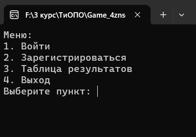

## Описание игры
Необходимо угадать 4-х значное число, которое генирируется случайным образом.
После каждой попытки ввода этого числа, у вас будет появляться подсказка - цифра угадана и стоит на своем месте или цифра угадана, но стоит не на своем месте.
Игра завершиться, как только число будет полностью угадано.
***
## Генерация числа с уникальными цифрами.
```
static string GenerateUniqueNumber()
{
    Random random = new Random();
    string digits = "0123456789";
    string secretNumber = "";

    while (secretNumber.Length < 4)
    {
        char digit = digits[random.Next(digits.Length)];
        if (!secretNumber.Contains(digit))
        {
            secretNumber += digit;
        }
    }

    return secretNumber;
}
```
***
## Скриншот главного меню
